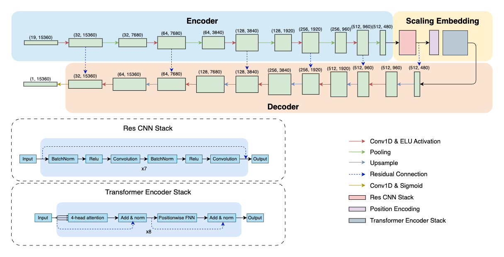

# Scaling U-Net with Transformer for Simultaneous Time-Step Level Detection from Long EEG Recordings
This repository is the official implementation of "Scaling U-Net with Transformer for Simultaneous Time-Step Level Detection from Long EEG Recordings".

Our model propose a U-Net-based deep learning model for time-step level EEG analysis. We employ a scaling embedding module that comprises a ResCNN stack and a Transformer encoder stack, between the original U-Net architecture's encoder and decoder, to scale up the model size and to capture both local features and global context information through convolution layers and the global attention mechanism. Such sequence-to-sequence modeling enables the model to learn the representation and do classification tasks at the time-step scale, which significantly boosts the algorithm's efficiency on the event-centric tasks, such as seizure detection, by getting rid of redundant overlapping inference and extensive post-processing steps a window-level classification model requires to convert discrete predictions into precise annotation report with onset and duration time. We further propose to use an attention-pooling module to adapt the time-step embedding for window-level classification problems. 

Experiments demonstrate that our model achieves the **state-of-the-art performance** under various time-step and window-level classification tasks. The runtime analysis and cross-dataset evaluation further highlight the model's **efficiency, robustness, and generalization ability**.


## Three Different Tests

Starting from this point, the remainder of the document is divided into three main sections, each focusing on a specific task:

- [Seizure Detection](#seizure-detection)  
- [Sleep Stage Classification](#sleep-stage-classification)  
- [Pathological (Abnormal) Detection](#pathologicalabnormal-detection)

<br><br><br><br>

# Seizure Detection

## Seizure Detection Requirements

To install requirements:

```bash
pip install -r ./SeizureDetection/requirements.txt
```

## Seizure Detection Datasets Download

### Siena Scalp EEG Database

- 📥 **Download:** [Siena Scalp EEG Database on PhysioNet](https://physionet.org/content/siena-scalp-eeg/1.0.0/)
- 📂 **Save location:** 
- 📄 **License:** [Creative Commons Attribution 4.0 International](https://www.physionet.org/content/siena-scalp-eeg/view-license/1.0.0/)
- 📚 **Reference:**  
  *Paolo Detti. Siena scalp EEG database. PhysioNet. doi, 10:493, 2020.*

---

### TUH EEG Seizure Corpus v2.0.3

- 📥 **Download:** [TUSZ v2.0.3](https://isip.piconepress.com/projects/nedc/html/tuh_eeg/#c_tueg)
- 📝 **Request Access:**  
  - Fill out [this access form (PDF)](https://isip.piconepress.com/projects/nedc/forms/tuh_eeg.pdf)  
  - Email the signed form to [help@nedcdata.org](mailto:help@nedcdata.org) with the subject: **Download The TUH EEG Corpus**
- 📂 **Save location:** 
- 📚 **Reference:**  
  *Vinit Shah, Eva Von Weltin, Silvia Lopez, James Riley McHugh, Lillian Veloso, Meysam Golmohammadi, Iyad Obeid, and Joseph Picone. The Temple University Hospital Seizure Detection Corpus. Frontiers in Neuroinformatics, 12:83, 2018.*

---

### SeizeIT1

- 📥 **Download:** [SeizeIT1 Dataset - KU Leuven](https://rdr.kuleuven.be/dataset.xhtml?persistentId=doi:10.48804/P5Q0OJ)
- 📂 **Save location:** 
- 📄 **License:** [Custom KU Leuven License](https://rdr.kuleuven.be/dataset.xhtml?persistentId=doi:10.48804/P5Q0OJ)
- 📚 **Reference:**  
  *Kaat Vandecasteele, Thomas De Cooman, Jonathan Dan, Evy Cleeren, Sabine Van Huffel, Borbála Hunyadi, and Wim Van Paesschen. Visual seizure annotation and automated seizure detection using behind-the-ear electroencephalographic channels. Epilepsia, 61(4):766–775, 2020.*

---

### Dianalund

---

# Sleep Stage Classification

## Sleep Stage Classification Requirements

To install requirements:

```bash
pip install -r ./SleepStageClassification/requirements.txt
```

## Sleep Stage Classification Datasets Download

### Sleep-EDFx
- 📥 **Download:** [sleep-edfx](https://www.physionet.org/content/sleep-edfx/1.0.0/)
- 📂 **Save location:** 
- 📄 **License:** [Open Data Commons Attribution License v1.0](https://www.physionet.org/content/sleep-edfx/view-license/1.0.0/)
- 📚 **Reference:**  
  *Bob Kemp, Aeilko H Zwinderman, Bert Tuk, Hilbert AC Kamphuisen, and Josefien JL Oberye. Analysis of a sleep-dependent neuronal feedback loop: the slow-wave microcontinuity of the eeg. IEEE Transactions on Biomedical Engineering, 47(9):1185–1194, 2000.*


# Pathological(abnormal) Detection

## Pathological(abnormal) Detection Datasets Download

### TUH Abnormal EEG Corpus v3.0.1
- 📥 **Download:** [TUAB: v3.0.1](https://isip.piconepress.com/projects/nedc/html/tuh_eeg/#c_tueg)
- 📝 **Request Access:**  
  - Fill out [this access form (PDF)](https://isip.piconepress.com/projects/nedc/forms/tuh_eeg.pdf)  
  - Email the signed form to [help@nedcdata.org](mailto:help@nedcdata.org) with the subject: **Download The TUH EEG Corpus**
- 📂 **Save location:** 
- 📚 **Reference:**  
  *Vinit Shah, Eva Von Weltin, Silvia Lopez, James Riley McHugh, Lillian Veloso, Meysam Golmohammadi, Iyad Obeid, and Joseph Picone. The Temple University Hospital Seizure Detection Corpus. Frontiers in Neuroinformatics, 12:83, 2018.*